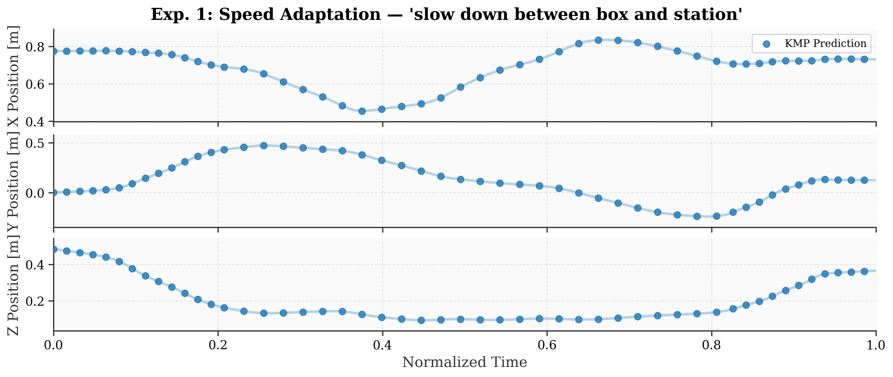
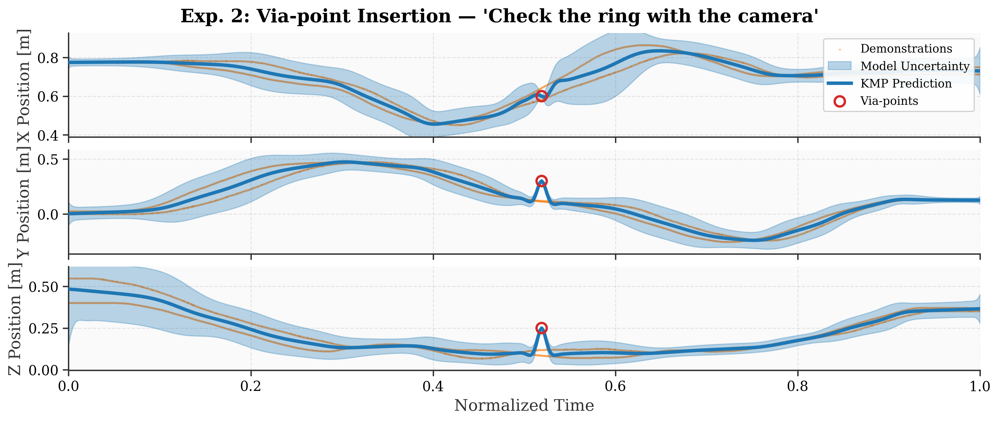
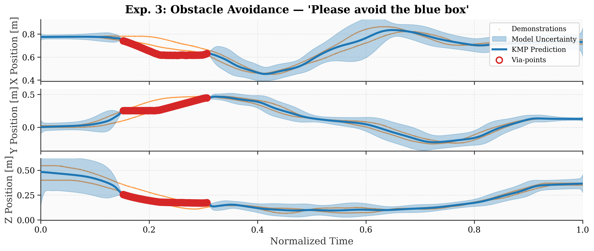
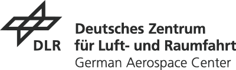

# IROSA: Interactive Robot Skill Adaptation using Natural Language

[](https://opensource.org/licenses/MIT)
[](https://www.python.org/downloads/)
[](https://github.com/DLR-RM/IROSA/actions/workflows/ci.yml)

<base target="_blank">

Authors: [Markus Knauer](https://markusknauer.github.io/), Alin Albu-Schäffer, Freek Stulp, and João Silvério

Responsible: Markus Knauer (markus.knauer@dlr.de)
Research Scientist @ German Aerospace Center (DLR), Institute of Robotics and Mechatronics, Munich, Germany &
Doctoral candidate & Teaching Assistant @ Technical University of Munich (TUM), Germany.

This repository contains the open-source code for our paper on interactive robot skill adaptation using natural language and tool-based LLM architectures.

If you are interested, you can find similar projects on [https://markusknauer.github.io](https://markusknauer.github.io/)

[IEEE paper](https://ieeexplore.ieee.org/document/11425760) | [ArXiv paper](https://arxiv.org/abs/2505.00861) | [ELIB paper](https://elib.dlr.de/223194/)


## Overview

### Abstract
Foundation models have demonstrated impressive capabilities across diverse domains, while imitation learning provides principled methods for robot skill adaptation from limited data.
We present a novel framework that enables open-vocabulary skill adaptation through a tool-based architecture maintaining a protective abstraction layer between the language model and robot hardware.
Our approach leverages pre-trained LLMs to select and parameterize specific tools for adapting robot skills without requiring fine-tuning or direct model-to-robot interaction.
We demonstrate the framework on a 7-DoF torque-controlled robot performing an industrial bearing ring insertion task, showing successful skill adaptation through natural language commands for speed adjustment, trajectory correction, and obstacle avoidance while maintaining safety, transparency, and interpretability.

### Architecture (Paper Section IV)

The system implements a five-step workflow (Algorithm 1 in the paper):

1. **User Query**: User observes robot execution and provides a natural language instruction
2. **Tool Selection**: LLM selects appropriate tool(s) from the available tool set via JSON schema-based function calling
3. **Tool Parameterization**: LLM extracts parameters from the instruction and environment observations
4. **Tool Execution**: Validated tool modifies the KMP trajectory representation
5. **Feedback**: Robot executes modified skill, user provides further instructions

```
User Command (natural language)
         │
         ▼
┌─────────────────────────┐
│  LLM (tool calling)     │  ← OpenAI-compatible API (Ollama, vLLM, OpenAI, ...)
│  Selects & parameterizes│
│  tools from JSON schema │
└────────┬────────────────┘
         │
         ▼
┌─────────────────────────┐
│  Validation & Execution │  ← Type, range, workspace checks
│  • SpeedModulation      │     (Paper Section IV-C)
│  • ViaPointInsertion    │
│  • ObstacleAvoidance    │
└────────┬────────────────┘
         │
         ▼
┌─────────────────────────┐
│  KMP Model              │  ← Kernelized Movement Primitives
│  Trajectory update      │     (Paper Section III)
└────────┬────────────────┘
         │
         ▼
┌─────────────────────────┐
│  Robot Execution        │  ← PyBullet simulation or real robot
└─────────────────────────┘
```

### Key Tools (Paper Section IV-D)

| Tool | Paper Section | Purpose | Parameters |
|------|--------------|---------|------------|
| `SpeedUpRobot` / `SlowDownRobot` | IV-D, Eq. 3-4 | Temporal trajectory adjustment | speed_value, adaption_start, adaption_end |
| `AddViaPointsAtTime` | IV-D | Spatial trajectory correction via KMP via-points | input_values (times), output_values (positions) |
| `AddRepulsionPoint` | IV-D, Eq. 5-6 | Obstacle avoidance via SDF-based correction | position, radius/dimensions |
| `GetViaPoints` / `RemoveViaPoints*` | - | Via-point management | - |
| `GetKMPParameters` / `SetKMPParameters` | - | KMP hyperparameter adjustment | kernel_length |
| `TellUserAMessage` | - | Robot-to-user communication | message |
| `NoToolIsAvailable` | - | Fallback when no tool applies | reason |

### Code Structure

```
irosa/
├── core/
│   ├── tool.py                  # Tool base class + Toolkit (JSON schema generation)
│   ├── llm_client.py            # OpenAI-compatible LLM client with tool calling
│   └── trajectory_corrector.py  # SDF-based obstacle avoidance (sphere, OBB)
├── models/
│   ├── kmp_core.py              # KMP algorithm (GMM, kernel, via-points)
│   └── kmp.py                   # KMP wrapper for LLM interaction
├── robots/
│   ├── robot.py                 # Abstract robot with speed modulation
│   └── sim.py                   # PyBullet simulation environment
├── tool_definitions/
│   ├── general.py               # NoToolIsAvailable, TellUserAMessage
│   ├── kmp.py                   # Via-point and obstacle avoidance tools
│   └── robot.py                 # SpeedUpRobot, SlowDownRobot
├── main.py                      # Interactive loop (Algorithm 1)
└── exceptions.py
```

### Related Work

The KMP algorithm used in this project is based on our previous work on task-parameterized movement primitives:
- **Code**: [DLR-RM/interactive-incremental-learning](https://github.com/DLR-RM/interactive-incremental-learning)
- **Paper**: M. Knauer et al., "Interactive incremental learning of generalizable skills with local trajectory modulation," IEEE RA-L, 2025.


## Setup

### Install from source

```bash
git clone https://github.com/DLR-RM/IROSA.git
cd IROSA
pip install -e .
```

### With simulation support (PyBullet)

```bash
pip install -e ".[sim]"
```

### With development tools

```bash
pip install -e ".[tests,sim]"
```


## Running the Paper Experiments

Each experiment script reproduces one of the three evaluation scenarios from Section V of the paper.
The scripts demonstrate the tool-based adaptation workflow without requiring an LLM connection.

### Experiment 1 (Section V-B): Speed adaptation

Command: *"slow down between box and station"* — demonstrates trajectory segment determination and speed modulation.

```bash
python examples/experiment_speed.py
```

<p align="center">
  
</p>

### Experiment 2 (Section V-C): Trajectory correction via via-point insertion

Command: *"Check the ring with the camera on the left"* — demonstrates new object integration and via-point insertion.

```bash
python examples/experiment_viapoint.py
```

<p align="center">
  
</p>

### Experiment 3 (Section V-D): Obstacle avoidance

Command: *"Please avoid the blue box"* — demonstrates OBB SDF construction, trajectory correction, and repulsion points.

```bash
python examples/experiment_obstacle.py
```

<p align="center">
  
</p>


## Usage

### Interactive Mode (with LLM)

Requires a running LLM server (e.g., [Ollama](https://ollama.ai/)) with a model that supports tool/function calling:

```bash
# Start Ollama with a model
ollama pull qwen2.5:72b

# Run IROSA interactive loop
python -m irosa.main --demo data/demonstrations.npz --llm-model qwen2.5:72b
```

Supported LLM backends (any OpenAI-compatible API):
- **Ollama**: `--llm-url http://localhost:11434/v1 --llm-key ollama`
- **vLLM**: `--llm-url http://localhost:8000/v1 --llm-key vllm`
- **OpenAI**: `--llm-url https://api.openai.com/v1 --llm-key sk-...`

### Programmatic Mode (without LLM)

```python
import numpy as np
from irosa.models.kmp import KMPWrapper

# Train KMP from demonstrations
model = KMPWrapper(demonstration_path="data/demonstrations.npz", force_retrain=True)

# Speed modulation: slow down between t=0.55 and t=0.72
model.robot.change_predicting_frequency(
    percentual_factor=50, adaption_start=0.55, adaption_end=0.72
)

# Via-point insertion: add waypoint at camera position
model.add_viapoints(
    input_via=[[0.5]],
    output_via=[[0.6, 0.3, 0.25, 1.0, 0.0, 0.0, 0.0]],
)

# Obstacle avoidance: avoid box with OBB dimensions
model.add_repulsion_point(
    position=np.array([0.75, 0.35, 0.23]),
    dimensions=[0.15, 0.225, 0.235],  # width, length, height in meters
    safety_margin=0.02,  # 2cm safety margin
)
```


## Tests

```bash
make test
```


## Development

```bash
make commit-checks   # format + type check + lint
make test            # run tests
```


## Citation

If you use our ideas in a research project or publication, please cite as follows:

```bibtex
@article{knauer2025irosa,
  author={Knauer, Markus and Albu-Sch{\"a}ffer, Alin and Stulp, Freek and Silv{\'e}rio, Jo{\~a}o},
  title={Interactive robot skill adaptation using natural language},
  journal={arXiv preprint arXiv:2505.00861},
  year={2025},
  keywords={LLM; Tool Use; Robot Learning; Movement Primitives; Natural Language},
}
```

If you use the KMP algorithm, please also cite:

```bibtex
@ARTICLE{knauer2025,
  author={Knauer, Markus and Albu-Sch{\"a}ffer, Alin and Stulp, Freek and Silv{\'e}rio, Jo{\~a}o},
  journal={IEEE Robotics and Automation Letters (RA-L)},
  title={Interactive incremental learning of generalizable skills with local trajectory modulation},
  year={2025},
  volume={10},
  number={4},
  pages={3398-3405},
  doi={10.1109/LRA.2025.3542209}
}
```


---

<div align="center">
  <a href="https://www.dlr.de/EN/Home/home_node.html"></a>
</div>
